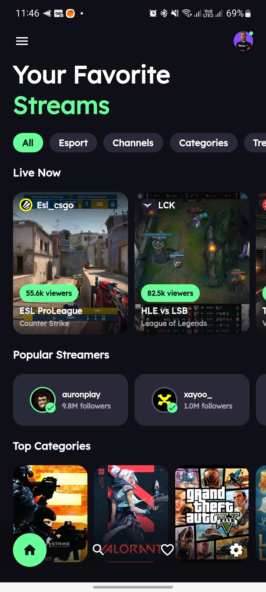

# Streaming App - Flutter UI

Projeto de estudo para criar um app baseado em um UI encontrado no Dribbble usando Flutter.

Link da UI no Dribbble: [link](https://dribbble.com/shots/16357353--25-Streaming-App-MobileApp-Concept)

**Pacotes usados no projeto:**

- flutter_svg: [link](https://pub.dev/packages/flutter_svg)
- google_fonts: [link](https://pub.dev/packages/google_fonts)
- flutter_native_splash: [link](https://pub.dev/packages/flutter_native_splash)
- flutter_launcher_icons: [link](https://pub.dev/packages/flutter_launcher_icons)

### Projeto Final

